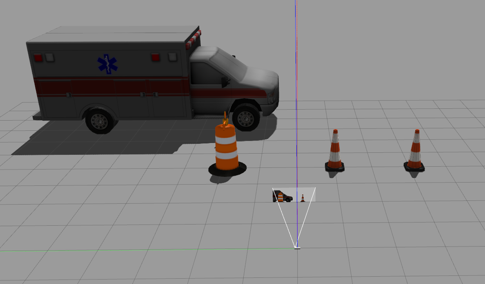
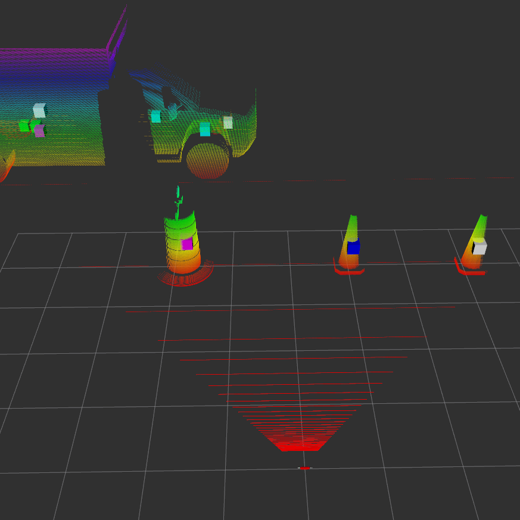
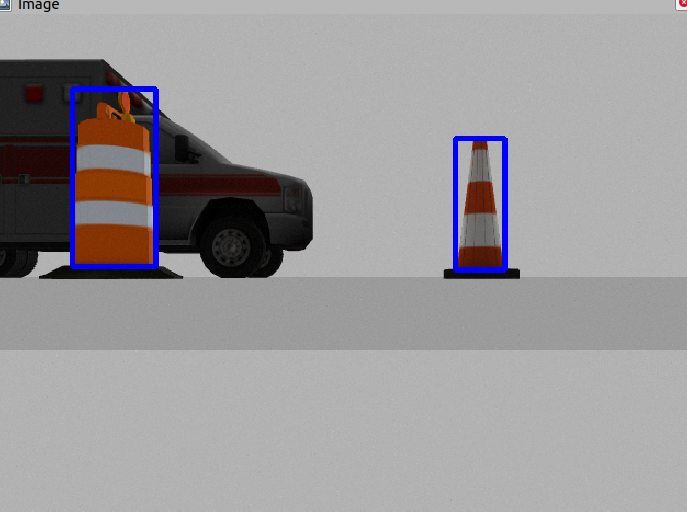

# Introduction

This example shows the implementation of a Intel Realsense D455 camera inside a simple virtual world made in Gazebo. The camera publishes it's pointcloud and image to ROS. One C++ example node detects objects in the pointcloud and publishes these as markers. Another Python example node detects the orange cones in the images and marks these in the image that is published by the node. This image, together with the pointcloud and the marker detections is visualized in Rviz. 

Virtual environment in Gazebo
:-----------------------------:



Pointcloud             |  Image
:-------------------------:|:-------------------------:
  |  


# Requirements

This example is made using ROS Noetic and there is no garuantee that it works with other distributions. Both OpenCV and PCL libraries are needed for the detection nodes.  


# Install

To install the packages follow:
```bash
mkdir catkin_ws
cd catkin_ws
git clone https://github.com/thijs83/Virtual-Intel-Depth-Camera.git
catkin_make
```


# Get started

To launch the whole setup:

```bash
source devel/setup.bash
roslaunch realsense_d455 test_environment.launch
```

This will launch Gazebo and Rviz, and it will start the python and c++ node.

# Packages

## realsense_d455

This package contains all models to setup the virtual environment and publishing the camera output to ROS

## pointcloud_filter

This package contains an example pointcloud filter in c++ that detects objects in the pointcloud retrieved from the camera.

## image_filter 

This package contains an image filter example using a python script. The filter searches for the colors of the cone (white/orange) and then adds a contour around the detections 

# References

Two main github repositories are used to implement the virtual D455 camera:
[pal-robotics/realsense_gazebo_plugin](https://github.com/pal-robotics/realsense_gazebo_plugin)
[IntelRealSense/realsense-ros](https://github.com/IntelRealSense/realsense-ros)
